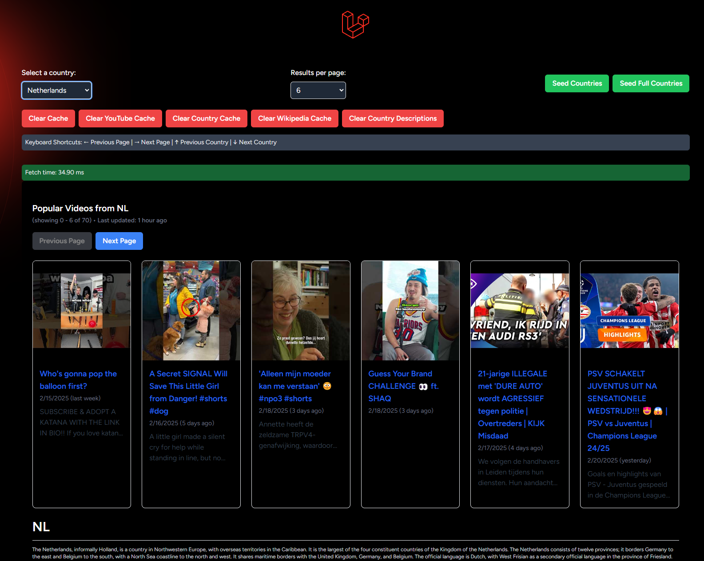

# Laravel Country Info Viewer: Popular YouTube video caching & Wikipedia information retreival
## Overview
The project includes a Laravel job (`Prefetcher`) and a YouTube API client (`YouTubeClient`) that efficiently fetches and caches popular videos. It also includes a `WikipediaClient` for fetching country descriptions and various routes for cache management and data seeding.

Some things are left as TODOs. There is also an MVP (first commit), which offers a significantly reduced feature set and caches based on YouTube's own pageTokens. Their prevPageToken and nextPageToken implementation means that this method resulted in caching the same pages multiple times (for example, the first page with token CAAQAA becomes CDIQAA). I've implemented a wrapper that will allow you to specify any number of maxResults, and numerical pageTokens.

## How to deploy
You will need to have PHP, NPM, and Composer already installed. Refer to https://laravel.com/docs/11.x/installation#docker-installation-using-sail to setup Docker. I used Laravel v11.42.1, PHP v8.4.4, WSL2 + Docker Desktop on Windows.
Then you can clone and deploy the project using Laravel Sail:
```bash
git clone https://github.com/Iaotle/bravoure-challenge.git project
cd project
# copy the .env.example file, preconfigured except for the YouTube API key.
cp .env.example .env
# IMPORTANT: add your own YouTube API key to the .env file (10'000 queries a day for free)
composer install
./vendor/bin/sail up
```
The one-time setup scripts that seed the database can be re-run on startup by deleting the `.initialized` file in the app's root directory.
- Should run at port 9000 or APP_PORT.
- Deploys one queue worker (see `supervisord.conf`)
- Run `force_setup_sail.sh` to run some commands to reset/refresh container configuration if something is not working as expected. Will also run artisan tests.

I've tried setting up a fresh container and it seems to work out of the box, but I have composer, npm, php8.4 already installed. The vendor folder will be generated by running `composer install`, and the NPM commands will be run in the container's entrypoint script in docker-compose.yml, so you don't need to run them manually.

### Local deployment
Running outside a Docker container will require you to also install a database client and a cache client (redis for example) and configure the app to use them in the .env file. You can then run the server yourself using `php artisan serve`, and compile the frontend using Vite: `npm run prod` (for which you will need to run `npm install`).


## E2E test in python
- Refreshes the whole cache
- Fetches all pages for all countries and checks that the cache hits are faster
- Checks that dispatcher job was correctly sent on first request
- Run `python3 e2e_test.py`

## PHPUnit tests with mocks
- Don't rely on the YouTube API when testing
- Mock token service, mock http, etc.
- Run `./vendor/bin/sail artisan test` to test it


## Manual testing
- Look in `storage/logs/laravel.log` for some debug outputs
- Set DB/CACHE env variables to database and refresh the container to use a DB explorer (like e.g. phpmyadmin).
- Go to the frontend (default http://127.0.0.1:9000) and use it, here's an example of what it should look like:



# API overview


## Country API
- `/countries`: Main endpoint, returns the wikipedia extract and videos. Supports `country`, `pageToken`, `maxResults` query parameters.
- `/supported-countries`: Fetches country names and ISO codes.

## Cache Management Routes
Keep in mind that the database cache does not support tagging, while redis does.
- `/clear-cache`: Clears all caches.
- `/clear-country-cache/{country}`: Clears YouTube and Wikipedia caches for a specific country.
- `/clear-youtube-cache`: Clears only the YouTube cache.
- `/clear-wikipedia-cache`: Clears only the Wikipedia cache.
- `/clear-country-description`: Clears stored country descriptions in the database. If we already cached once from wikipedia, we will never make a request to the API and will instead use the DB

## Data Seeding Routes
- `/seed-countries`: Runs `CountrySeeder`. Seeds the default list of countries without talking to restcountries, so it should always work.
- `/seed-full-countries`: Runs `FullCountrySeeder`. Not recommended as it will make a lot of network requests when requesting all countries for example. Also the restcountries API has some timeout problems so this might not be reliable (I put in a retry and timeout to the request and it's worked for me every time since, YMMV).


# Main Laravel components

## Prefetcher Job
- Uses a next-page token to prefetch and cache YouTube videos.
- Gets dispatched to fetch a full list of videos for a country, recursively dispatches more jobs if there are more pages.
- Logs errors when fetching fails.

## YouTubeClient
- Fetches and caches popular YouTube videos.
- Implements caching with Redis, avoiding duplicate API requests while the cache is fresh.
- Dispatches the `Prefetcher` job for continuous prefetching.

## TokenService
- Converts YouTube's next-page tokens to numeric offsets for better pagination.
- Keeps a list of tokens in cache. We have more than enough page tokens.


## WikipediaClient
- Retrieves country descriptions from Wikipedia.
- Use the database if a description is already stored.
- Caches exerpts in redis for 24 hours to minimize API/DB calls.
